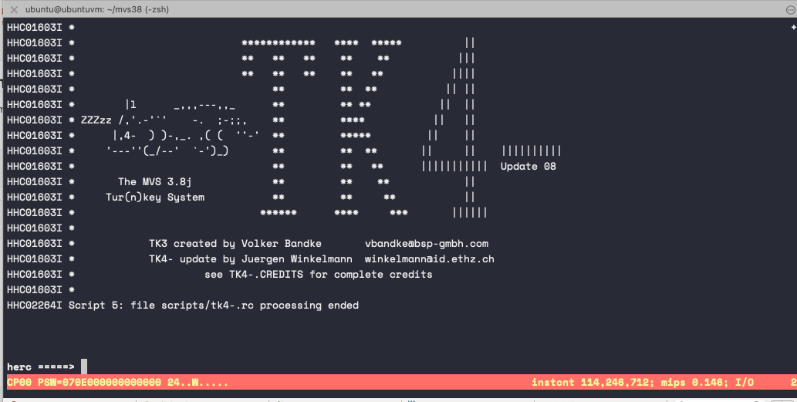
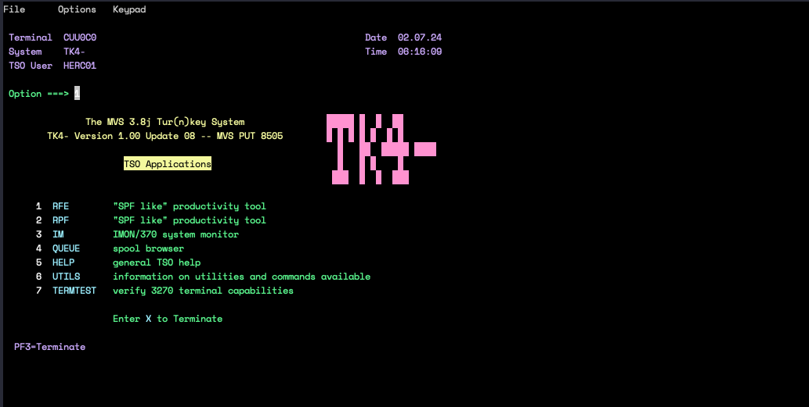

[TOC]

## Technology

- [UTM](https://mac.getutm.app/)
  Virtual machines for Mac. Free, supports both arm / amd architecture
- [Hercules](http://www.hercules-390.eu/)
  Hercules is an open source software implementation of the mainframe System/370 and ESA/390 architectures, in addition to the latest 64-bit z/Architecture. Hercules runs under Linux, Windows, Solaris, FreeBSD, and Mac OS X.
- [MVS 3.8j Turnkey 4- System](https://wotho.pebble-beach.ch/tk4-/) ([Github](https://github.com/mainframed/tk4/tree/main))
  Operation system built to run under Hercules emulator
- [x3270](http://x3270.bgp.nu/)
  Terminal emulator that runs over a TELNET connection. Runs on most Unix-like operation systems (in our case Mac OS)


## Download and install virtual machine

### UTM

Download and install UTM virtual machine https://mac.getutm.app/

>  Note: UTM is chose over Virtualbox since it is designed to be compatible to Apple Silicon and supports multiple OS architecture.

### Ubuntu Server distribution

Download Ubuntu Server for x86 ISO image from https://ubuntu.com/download/server

The LTS version used in this demo is `ubuntu-24.04-live-server-amd64`. Download link: https://releases.ubuntu.com/noble/ubuntu-24.04-live-server-amd64.iso

> Note: The ARM architecture distribution has a better compatilibility to OSX however demands a local build of Hercules binaries and MVS binaries in later stages. I was able to build Hercules but failed to build MVS in aarch64 architecture, so had to switch to **amd64** architecture.

> If we were able to find a way to make MVS work in aarch64, it is still preferred to use arm architecture due to its better compatilibity and performance indicators

### Install and start the VM

Create a new virtual machine using the ISO image downloaded. Bootstraping the OS following the stpes. The default network mode is "shared network", which is similar to NAT. Keep it the default option and it should configure the netcard automatically when bootstraping.

Continue the installation with default settings except for OnenSSH. It is preferred to install OpenSSH so that we can ssh into the virtual host from our OSX terminal, which is little bit more friendly than the UTM window.

After all packages are installed, the boot program will attempt to restart the system. If the system freezes on reboot, that might because the VM is waiting the ISO to be unmounted. Try selecting the disk icon on top right and click "eject" CD/DVD ISO. Then restart the VM by clicking the backward play button on the top left.

If everything goes right, the session should ask you to provide username and password to login with the password set earlier.

```bash
# Then insetall net tools 
sudo apt-get install net-tools
# get IP address, in my case, 192.168.64.4
ifconfig
```

```bash
# I prefer to use my iTerm terminal + ssh for better searching / multi-pane visual. 
# Switch back to OSX iTerm now we should be able to ssh to the vm
# I'm using my github private key as the public key were loaded form github when bootstraping
ssh -i ~/.ssh/github/github ubuntu@192.168.64.4
```

## Install Hercules

Detailed instruction is available here: https://sdl-hercules-390.github.io/html/hercinst.html. All of the steps listed below are a over-simplified version of the official instruction. Please don't hesitate to go back to official guide if anything doesn't work.

1. Building from source (as it is risky to used the pre-compiled binaries)
   ```bash
   # Step 0, install required packages
   sudo apt-get -y install git wget time
   sudo apt-get -y install build-essential cmake flex gawk m4 autoconf automake libtool-bin libltdl-dev
   sudo apt-get -y install libbz2-dev zlib1g-dev
   sudo apt-get -y install libcap2-bin
   
   # Step 1, clone the source code repository
   mkdir -p /home/ubuntu/hercules
   cd hercules
   git clone https://github.com/SDL-Hercules-390/hyperion.git
   ```

2. Verify you have all of the correct versions of the more important packages installed:

   ```bash
   # Step 2, check the environment before source build
   cd hyperion
   ./util/bldlvlck
   ```

3. Build the external packages
   Note, this step is mandatory for a non-Intel x86/x64 architecture build, and is supposed to be optional in our cases. But for safety, we still run a manually build for each of the external packages in order to create the static link libraries that Hercules will need to link with

   - The external packages are:

     - crypto: https://github.com/sdl-hercules-390/crypto.git

     - decNumber: https://github.com/sdl-hercules-390/decNumber.git

     - SoftFloat: https://github.com/sdl-hercules-390/SoftFloat.git

     - telnet: https://github.com/sdl-hercules-390/telnet.git

   ```bash
   # Step 3, build external packages
   
   mkdir -p /home/ubuntu/hercules/extpkgs
   cd ~/hercules/extpkgs
   
   # clone the repository
   git clone https://github.com/SDL-Hercules-390/gists.git
   cd gists/
   
   # update configurations if needed. When building for arm architecture, cpu type should be changed to aarch64. Not needed in our example
   vim extpkgs.sh.ini
   
   # the installation script will clone ext packages and build for us
   ./extpkgs.sh clone c d s t
   
   # update LIBRARY_PATH and CPATH to include the ext binaries
   echo 'export LIBRARY_PATH=/home/ubuntu/hercules/extpkgs/gists/lib:$LIBRARY_PATH' >> ~/.bashrc
   echo 'export CPATH=/home/ubuntu/hercules/extpkgs/gists/include:$CPATH' >> ~/.bashrc
   source ~/.bashrc
   ```

4. configure and build hercules
   ```bash
   cd /home/ubuntu/hercules/hyperion
   
   # the enable-extpkgs flag specifies the location where to fin ext packages. This is redundant to the LIBRARY_PAHT CPATH env variable. Doesn't harm to add here though
   ./configure --enable-extpkgs=/home/ubuntu/hercules/extpkgs/gists
   
   # Build
   # This step is pretty fast under arm architecture virtual machie. However it takes ~2 hours under the emulated amd architecture
   make
   ```

5. Install the program
   ```bash
   # Install the program
   sudo make install
   
   # Add libherc.so library path to LD_LIBRARY_PATH
   export LD_LIBRARY_PATH=/usr/local/lib:$LD_LIBRARY_PATH' >> ~/.bashrc
   source ~/.bashrc
   ```

6. Now we should be able to run Hercules
   ```bash
   sudo ./hercules
   sudo ./herclin
   
   # Or, run anywhere with .cnf file provided as an absolute path
   cd /home/ubuntu
   herclin -f /home/ubuntu/hercules/hyperion/hercules.cnf
   ```

   The user guide, and differences between `hercules` and `herclin` excutables can bd found [here](https://sdl-hercules-390.github.io/html/hercinst.html). Short version, `hercules` is the semi-graphical panel, `herclin` is the standard command-line style without a "fancy" dashboard.

Congratulations! We're done with Hercules.

## Install MVS TK4- OS

A detailed step to step guilde available here: https://bradrigg456.medium.com/run-your-own-mainframe-using-hercules-mainframe-emulator-and-mvs-3-8j-tk4-e8a85ebecd62. All of the steps listed below are a over-simplified version of the official instruction. Please don't hesitate to go back to official guide if anything doesn't work.

> Note:
> The original like to TK4- site is out of func: ~~http://wotho.ethz.ch/tk4-/~~. 
> **Use the mirror site instead: https://wotho.pebble-beach.ch/tk4-/**

```bash
# download the pre-built zip of tk4
sudo apt-get install unzip
wget --no-check-certificate https://wotho.pebble-beach.ch/tk4-/tk4-_v1.00_current.zip
unzip tk4-_v1.00_current.zip -d mvs38

# set it to console mode so it allows us to run command at the console
cd mvs38/unattended/
./set_console_mode
```

```bash
# Run MVS
# The script is smart enough to pick up the correct ver excutable based on you OS architecture
# wait ~3 minutes until you see the TK4 screen
cd ..
./mvs
```



## Connect via 3270 terminal

I prefer to install the 3270 terminal on my OSX system as it will be easier to setup and faster execution. Also Potentially more friendly for future automation.

Start another terminal window and

```bash
# Install x3270 client
brew install x3270
```

```
# Connect to Hercules
c3270 192.168.64.4:3270
```


Login with the default user (More info about the deafult users, refer to [TK4- user guide](https://wotho.pebble-beach.ch/tk4-/MVS_TK4-_v1.00_Users_Manual.pdf))

```properties
username=herc01
password=CUL8TR
```

Finally, we're in



## Run a demo

Now, can follow the instructions in this blog: https://bradrigg456.medium.com/run-your-own-mainframe-using-hercules-mainframe-emulator-and-mvs-3-8j-tk4-e8a85ebecd62 to send your first COBOL task to mainframe. 

To be continued...
